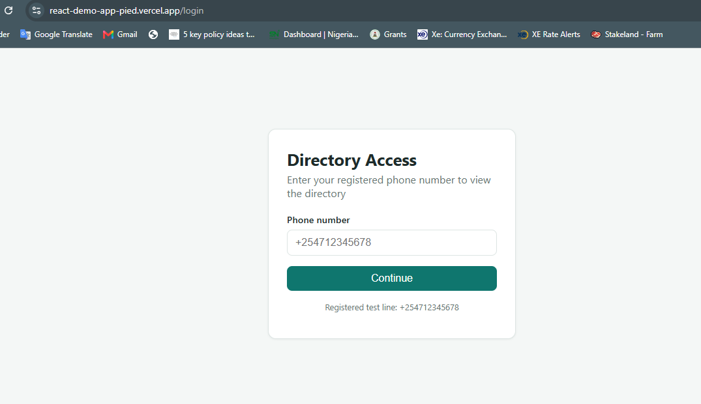
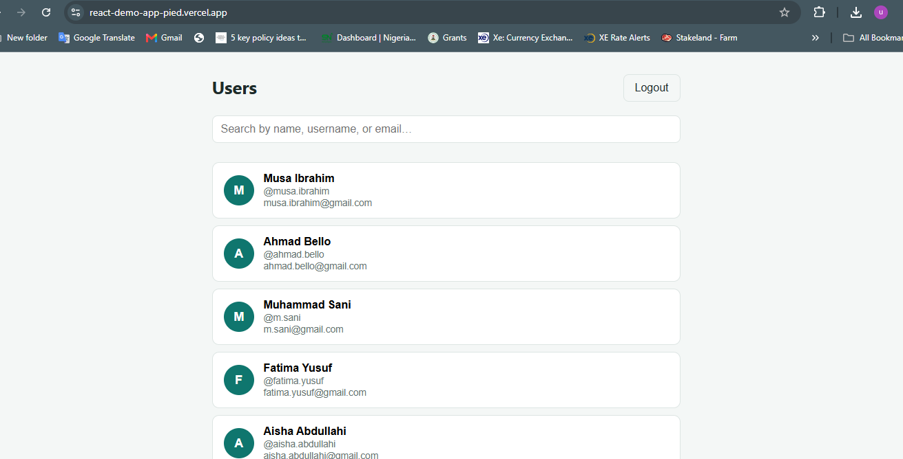
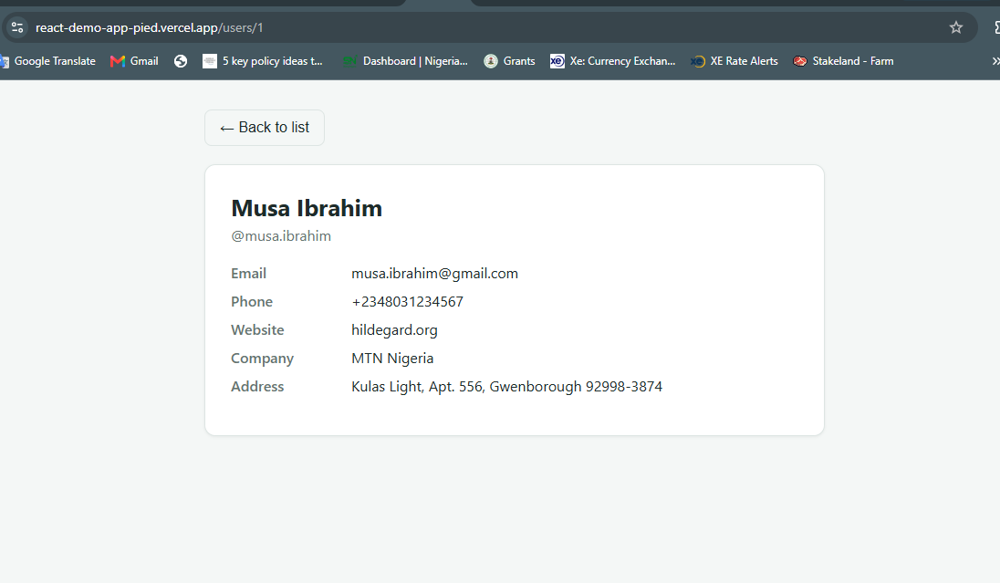

# Directory App — Login, User List & Detail View

Built by **Umar Idris Abubakar** ([github.com/umaridrisdev](https://github.com/umaridrisdev))
for a technical interview task. It has three
pages — **Login**, **Main (list + search)**, and **Detail** — backed by the
[JSONPlaceholder](https://jsonplaceholder.typicode.com) public API.

**Live demo:** [https://react-demo-app.vercel.app](https://react-demo-app.vercel.app) *(update this link once deployed — see Deployment section below)*
Demo login: `+254712345678`

## Tech stack

- **React 19** with functional components and Hooks
- **Vite** as the build tool / dev server
- **React Router v7** for client-side routing
- **Context API** (`AuthContext`) for auth state, persisted to `localStorage`
- **Custom CSS** for styling (no UI framework dependency)
- **Jest + React Testing Library** for unit/component tests

## Screenshots

| Login | Directory | Detail |
|---|---|---|
|  |  |  |

## Project structure

```
src/
├── components/
│   ├── ProtectedRoute.jsx   # Redirects to /login if not authenticated
│   ├── SearchBar.jsx        # Controlled search input
│   └── UserCard.jsx         # List item, navigates to detail page on click
├── context/
│   └── AuthContext.jsx      # Login state + localStorage persistence
├── data/
│   └── personas.js          # Nigerian name/company/phone overlay by user id
├── pages/
│   ├── LoginPage.jsx        # Phone number login with validation
│   ├── LoginPage.test.jsx   # RTL component tests
│   ├── MainPage.jsx         # Fetches + searches the user list
│   └── DetailPage.jsx       # Fetches + displays a single user
├── services/
│   └── api.js               # fetchUsers() / fetchUserById() — API layer
├── utils/
│   ├── validation.js        # Phone validation + mock login logic
│   └── validation.test.js   # Unit tests for validation logic
├── App.jsx                  # Route definitions
├── main.jsx                 # Entry point (BrowserRouter + AuthProvider)
└── index.css                # Global styles
```

## Getting started

```bash
npm install
npm run dev       # start the dev server (http://localhost:5173)
npm run build     # production build to /dist
npm run preview   # preview the production build
```

## Running tests

```bash
npm test          # run once
npm run test:watch
```

Tests included:

- `src/utils/validation.test.js` — unit tests for phone number validation and
  the mock login logic (required field, `+254` prefix check, digit-count
  check, and the demo-account check).
- `src/pages/LoginPage.test.jsx` — React Testing Library tests that render the
  Login page and simulate user typing/clicking to verify validation error
  messages and the happy path.

## How the app works

### 1. Login page (`/login`)

- Phone number input, required, must start with `+254` (matching the task
  brief's example country code) and be followed by exactly 9 digits (e.g.
  `+254712345678`).
- **Mock login**: only the demo number `+254712345678` — the exact example
  given in the task brief — is treated as a registered account. Any other
  correctly-formatted number is rejected with a clear message, and malformed
  numbers show a validation error instead.
- On success, the phone number is stored via `AuthContext` (backed by
  `localStorage`, so the session survives a page refresh) and the user is
  redirected to the Main page.
- `/` and `/users/:id` are wrapped in a `ProtectedRoute` that redirects back
  to `/login` if no one is signed in.

### 2. Main page (`/`)

- Fetches the user list from `GET https://jsonplaceholder.typicode.com/users`
  on mount — this is the real API call the task requires.
- `src/data/personas.js` then overlays Nigerian names, usernames/emails,
  phone numbers, and companies (MTN Nigeria, Dangote Group, GTBank, Tesla,
  etc.) onto the fetched records by id, so the directory reads naturally
  instead of showing the default placeholder data. The underlying fetch,
  ids, and loading/error handling are untouched — only display fields are
  relabeled.
- Handles `loading` and `error` states explicitly.
- A search bar filters the list **client-side and dynamically** as the user
  types, matching against name, username, and email (case-insensitive).
- Clicking a user card navigates to `/users/:id`.
- A **Logout** button clears the session and returns to the login page.

### 3. Detail page (`/users/:id`)

- Reads the `id` route param and fetches
  `GET https://jsonplaceholder.typicode.com/users/:id`.
- Displays name, username, email, phone, website, company, and address.
- Handles loading/error states, and includes a "Back to list" button.

## Deployment (Vercel)

The app is a static Vite build, so it deploys to Vercel with zero config
beyond the included `vercel.json`, which adds an SPA rewrite so that direct
links or refreshes on client-side routes (`/login`, `/users/3`, etc.) load
`index.html` instead of 404ing.

To deploy your own copy:

1. Push this repo to GitHub (already done: `github.com/umaridrisdev/react-demo-app`).
2. Go to [vercel.com](https://vercel.com) and sign in with GitHub.
3. Click **Add New → Project**, select `react-demo-app` from the repo list.
4. Vercel auto-detects the **Vite** framework preset:
   - Build command: `npm run build`
   - Output directory: `dist`
   (leave these as-is unless Vercel didn't autofill them)
5. Click **Deploy**. After a minute you'll get a live URL like
   `https://react-demo-app-<random>.vercel.app` (or a clean
   `https://react-demo-app.vercel.app` if that name is free).
6. Update the **Live demo** link at the top of this README with your actual
   deployed URL.

## Notes / possible extensions

- The API is read-only (JSONPlaceholder), so there's no real signup/auth
  backend — login is intentionally mocked per the task brief.
- Styling uses plain CSS custom properties for easy theming; swapping in
  Tailwind or Material UI would mainly touch `index.css` and the JSX
  `className` props, not the component logic.
- Additional tests worth adding for a production app: `MainPage` search
  filtering, `DetailPage` fetch/error states, and an integration test that
  walks Login → Main → Detail.
